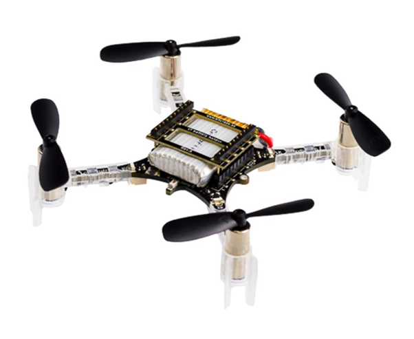
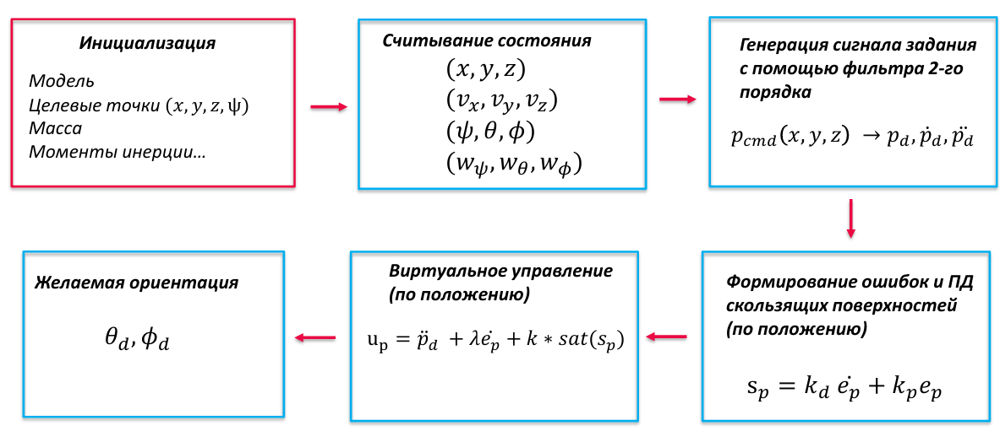
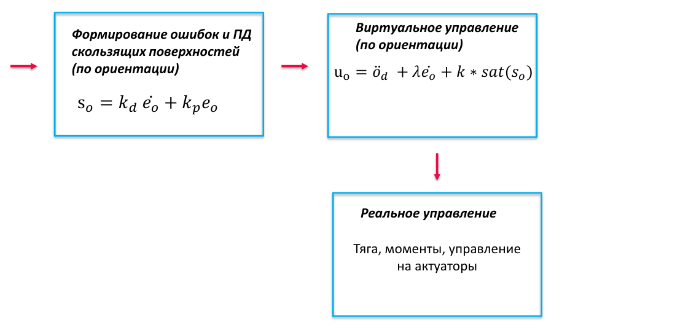

# Управление положением квадрокоптера Crazyflie 2 в среде MuJoCo

## Описание проекта

В проекте реализован алгоритм **автономного управления полётом квадрокоптера Bitcraze Crazyflie 2** по заданным точкам 
в трёхмерном пространстве с помощью SMC (sliding mode control) по ПД-поверхности.

---

## Общая структура алгоритма

Алгоритм управления состоит из следующих основных этапов:

